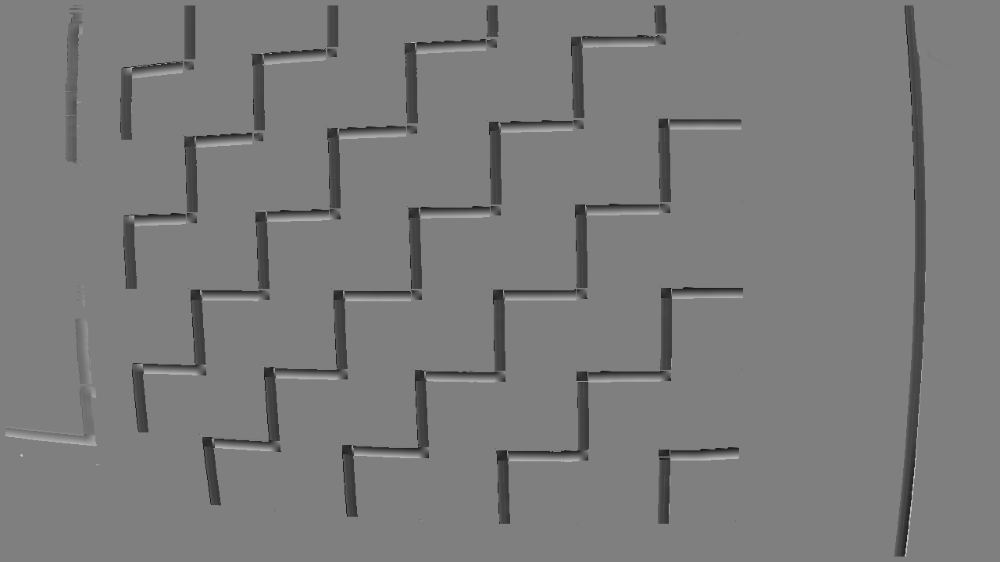

# Descriptions

The settings for each file with their images. These are all run with range=7.

All images are clamped. Darker means less unlikelihood and therefore higher probability.

## [None](./none.png)
No changes from defaults. Scaling factor is 0.5: an unlikelihood of 500 goes to 250. 
```rust
let mut opt = ToleranceOptions::default();
let weight = WeightageOptions::default();
unlikelihood /= 510.;
unlikelihood *= 255.;
```


## [Center Color Distance](./center_dist.png)
Weight for center_dist, color distance to the average of the four corners, is increased to 0.2 (keep in mind lock). Scaling factor is 1.0. 
```rust
let mut opt = ToleranceOptions::default();
let mut weight = WeightageOptions::new();
weight.center_dist = 0.2;
weight.lock();
unlikelihood /= 255.;
unlikelihood *= 255.;
```


## [Black Corner Distance](./black_dist.png)
Increase weight for black_dist. Lock means weight.black_dist will be 5/6 and weight.avg will be 1/6. Scaling factor is 1.0.
```rust
let mut opt = ToleranceOptions::default();
let mut weight = WeightageOptions::new();
weight.black_dist = 5.0;
weight.lock();
unlikelihood /= 255.;
unlikelihood *= 255.;
```


## [White Corner Distance](./white_dist.png)
Increase weight for white_dist. Increasing weight.white_dist seems to cause the cost function to decrease. At 5.0, white_dist has no effect at all. Seems to favor edges.
```rust
let mut opt = ToleranceOptions::default();
let mut weight = WeightageOptions::new();
weight.avg = 0.0;
weight.white_dist = 0.2;
weight.lock();
unlikelihood /= 255.;
unlikelihood *= 255.;
```


## [Intersection Distance](./intersect_dist.png)
Weight for intersect_dist is increased to 1.0 and avg to 0.0. Purely intersect_dist. Scaling factor is 20.0 because the distance is very small and difficult to percieve otherwise.
```rust
let mut opt = ToleranceOptions::default();
let mut weight = WeightageOptions::new();
weight.intersect_dist = 1.0;
weight.avg = 0.0;
weight.lock();
unlikelihood *= 20.;
```


