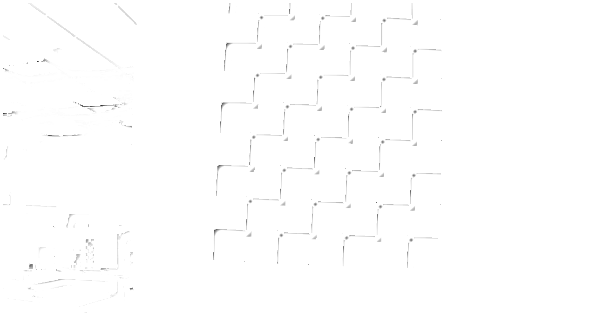
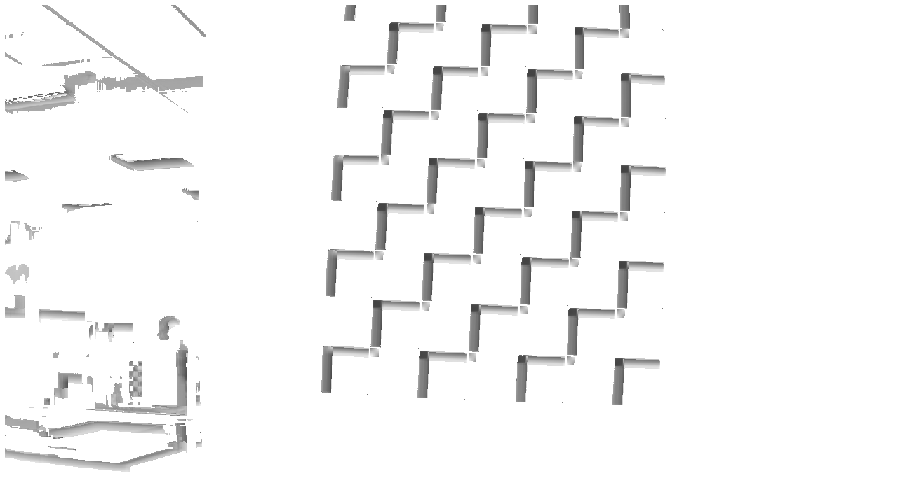
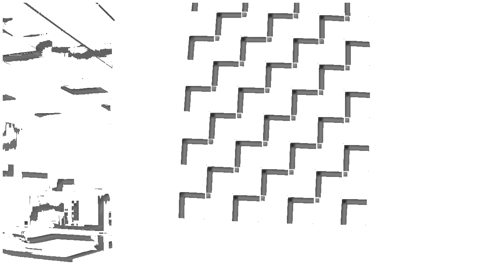

# Descriptions

The settings for each file with their images. These are all run with range=7.

All images are clamped. Darker means less unlikelihood and therefore higher probability. Complete white (or when scaled down, the corresponding gray) likely means that a transition point was not located, making the color default to white (or the scaled version of white).

## [Original Image](./no_mods.png)
]

## [None](./none_corrected.png)
No changes from defaults. Scaling factor is 1.0. 
```rust
let opt = ToleranceOptions::default();
let weight = WeightageOptions::default();
let scale_factor = 1.0;
```


## [None Incorrect](./none_incorrect.png)
This calculated weight with the intersection point dividing the four sections for black and white. 
```rust
let opt = ToleranceOptions::default();
let weight = WeightageOptions::default();
let scale_factor = 1.0;
```


## [Center Color Distance](./center_dist.png)
Weight for center_dist, color distance to the average of the four corners, is 1.0. Scaling factor is 0.5 in order to see the effect. The gray throughout is due to white becoming scaled down. The white is due to a transition point being located but with a high cost -- a large difference between the center color and the average of the corner colors. The lines in the middle of the white are likely to be the desired centers which fall on the actual corners in the image.
```rust
let mut opt = ToleranceOptions::default();
let mut weight = WeightageOptions::new();
weight.center_dist = 1.0;
weight.avg = 0.0;
weight.lock();
let scale_factor = 1.0;
```


## [Black Corner Distance](./black_dist.png)
Increase weight for black_dist. Scaling factor is 1.0.
```rust
let mut opt = ToleranceOptions::default();
let mut weight = WeightageOptions::new();
weight.black_dist = 1.0;
weight.avg = 0.0;
weight.lock();
let scale_factor = 1.0;
```


## [White Corner Distance](./white_dist.png)
Increase weight for white_dist. Increasing weight.white_dist seems to cause the cost function to decrease. At 5.0, white_dist has no effect at all. Seems to favor edges.
```rust
let mut opt = ToleranceOptions::default();
let mut weight = WeightageOptions::new();
weight.white_dist = 1.0;
weight.lock();
let scale_factor = 1.0;
```


## [Intersection Distance](./intersect_dist.png)
Weight for intersect_dist is increased to 1.0 and avg to 0.0. Purely intersect_dist. Scaling factor 1.0
```rust
let mut opt = ToleranceOptions::default();
let mut weight = WeightageOptions::new();
weight.intersect_dist = 1.0;
weight.avg = 0.0;
weight.lock();
unlikelihood *= 15.;
```


